# Spatial Relation Identification in Images Using Geometric Approaches

## 🧠 Overview

This repository implements geometric approaches for identifying spatial relationships between objects in images using the SpatialSense++ dataset. The project explores two main geometric descriptors: **Radial Line Model (RLM)** and **PHI Descriptor** based on Allen's interval relations, demonstrating that purely geometric features can effectively capture spatial relationships without requiring image processing or textual analysis.

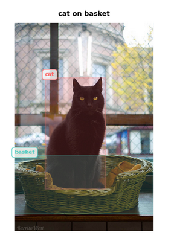

## 🎯 Objectives

- Develop geometric methods for spatial relation identification between two objects in images  
- Implement **RLM (Radial Line Model)** based on reference points and directional analysis  
- Implement **PHI Descriptor** founded on Allen's directional relations  
- Evaluate the combination of both approaches for improved performance  

## 📊 Dataset: SpatialSense++

The **SpatialSense++** dataset contains:

- **Total Images**: 10,440  
- **Total Annotated Relations**: 17,498
- **Used Relations (label=True only)**: ~8,749 (50%)
- **Average Relations per Image**: 1.68  
- **Spatial Predicates**: 9 unique spatial relations  
- **Object Categories**: 20 unique object types  

**Spatial Relations Covered**:
- `on`, `behind`, `in front of`, `next to`  
- `under`, `in`, `above`, `to the left of`, `to the right of`  

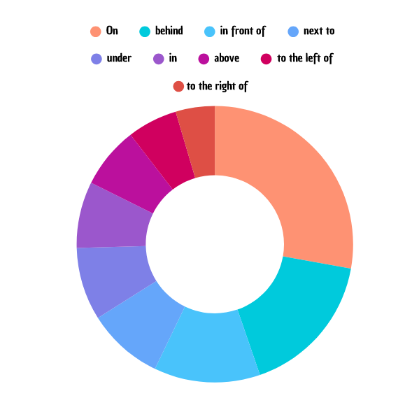

---

## 🔧 Methodology

### Method 1: Radial Line Model (RLM)

The RLM approach performs directional analysis using **120 radial directions**:

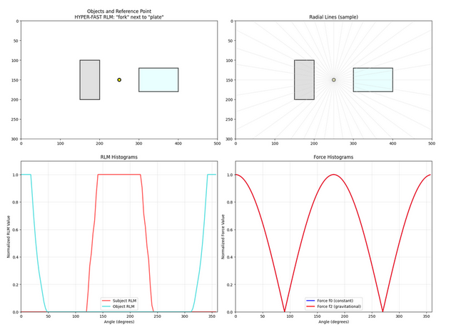

**Key Components**:

- **Convex Hull**: Detailed convex hull computation for complex objects  
- **Reference Point**: Calculated using convex hull intersection with center line (Equation 4)  
- **120 Radial Directions**: High-resolution directional analysis  
- **Force Models**: `f0` (constant) + `f2` (gravitational forces)  
- **Features**: 360D (120 directions × 3 components)  

---

### Method 2: PHI Descriptor (Allen Relations)

The PHI approach applies **Allen's 13 temporal relations** to spatial intervals:

<!-- Replace with Figure from slide 10-11: PHI method diagram -->
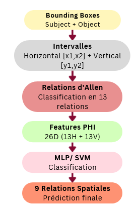

**Key Components**:

- **Horizontal Intervals**: [x1, x2] for each object  
- **Vertical Intervals**: [y1, y2] for each object  
- **Allen Relations**: 13 temporal relations classification  
- **Features**: 26D (13 horizontal + 13 vertical)

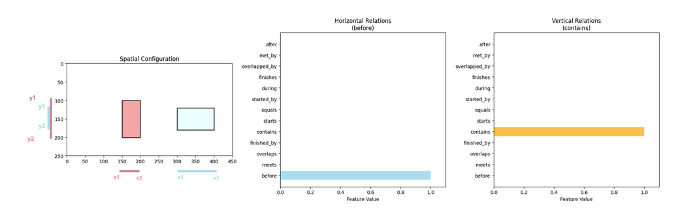

---

### Method 3: Combined RLM + PHI

Concatenation of both feature sets for enhanced spatial understanding:

- **Total Features**: 386D (360 RLM + 26 PHI)  
- **Classification**: MLP (386→512→256→9) / SVM  

<!-- Replace with Figure from slide 12: Combined method pipeline -->
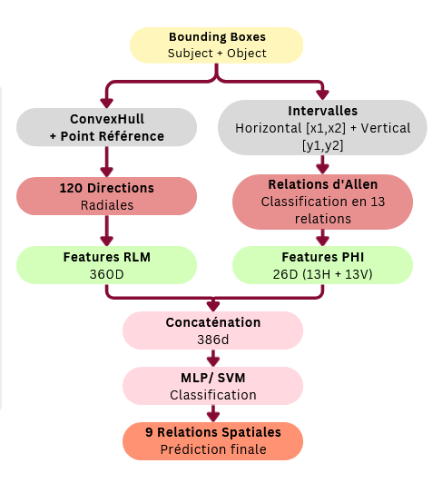

---

## 📈 Results

### Performance Comparison

| Method            | Features | MLP Accuracy | SVM Accuracy |
|------------------|----------|--------------|--------------|
| RLM Only         | 360D     | 40.5%        | 40.2%        |
| PHI Only         | 26D      | 37.9%        | 37.0%        |
| RLM + PHI        | 386D     | 41.8%        | 41.0%        |

---

### Confusion Matrices

<!-- Replace with Figures from slides 13-15: Confusion matrices for each method -->
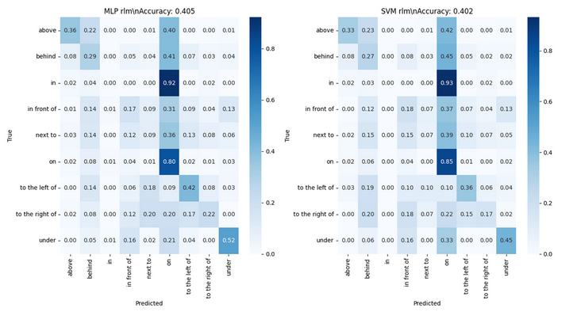
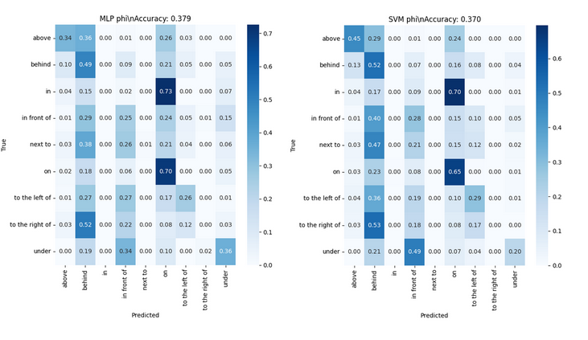
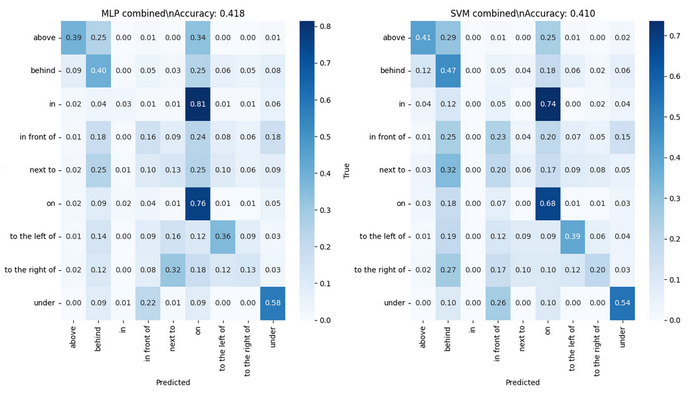

---

### Training Curves

The training process shows convergence with early stopping mechanisms:

<!-- Replace with Figure from slide 16: Training loss curves -->
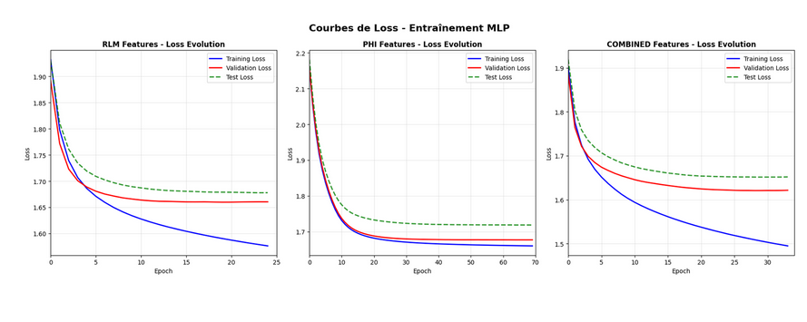

---

### Error Analysis

Common classification errors include:

- `'in'` predicted as `'on'`  
- `'behind'` predicted as `'on'`  
- `'in front of'` predicted as `'on'`  
- `'on'` predicted as `'behind'`  
- `'above'` predicted as `'on'`  

<!-- Replace with Figure from slide 17: Error examples with original images -->

---

### Directional Relations Classification

When simplified to **4 directional classes** (`ABOVE`, `BELOW`, `BESIDE`, `DEPTH`), the model achieves **56.6% accuracy**:

<!-- Replace with Figure from slide 18: 4-class confusion matrix -->
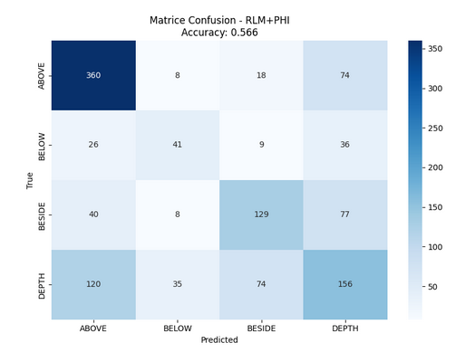

---

## 🔬 Technical Implementation

### Key Classes

- **`HyperFastExtendedRLM`**: Implements 120-direction RLM with ConvexHull  
- **`HyperFastPHIDescriptor`**: Implements Allen's relations for spatial intervals  
- **`AdvancedSpatialClassifier`**: Handles training and evaluation  
- **`SpatialErrorAnalyzer`**: Analyzes classification errors with visualizations  

---
## 📋 Requirements

- Python 3.7+  
- NumPy  
- Pandas  
- Matplotlib  
- Seaborn  
- Scikit-learn  
- SciPy  
- Transformers  
- Sentence-Transformers  
- Pillow (PIL)  
- tqdm
---
## 👨‍💻 Author

**REBAI Mohamed Younes**  
Université Paris Cité  

> For detailed implementation and experimental results, please refer to the Jupyter notebook provided in this repository.
